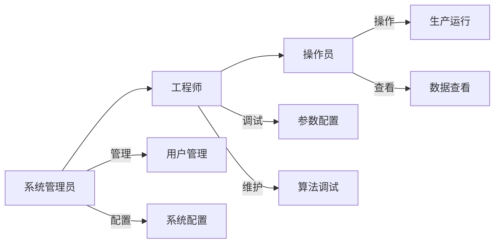
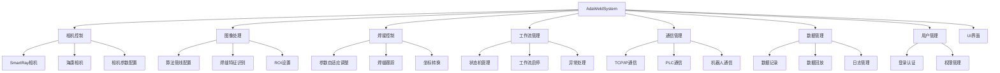
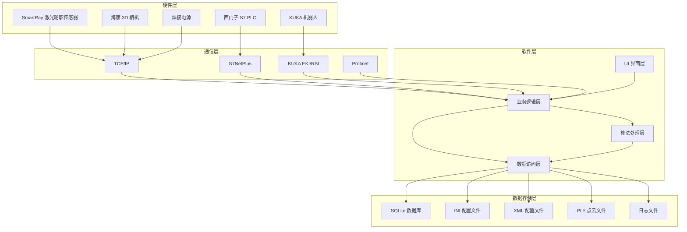
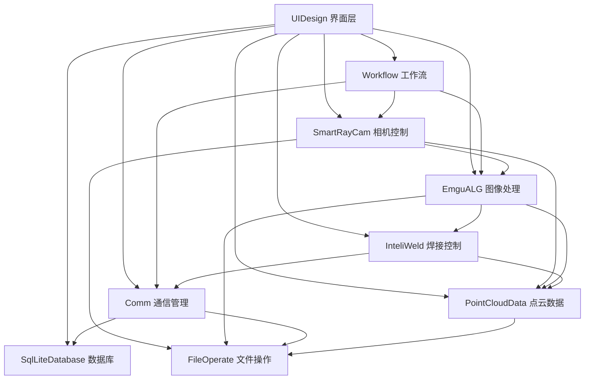

# 自适应焊接系统（AdaWeldSystem）产品软件设计需求书

**文档版本**：V1.0  
**编制日期**：2026年07月02日  
**编制单位**：MRDF-2608 研发项目组  
**项目名称**：自适应焊接系统（AdaWeldSystem）  

---

## 目录

1. [文档概述](#1-文档概述)
2. [项目背景](#2-项目背景)
3. [项目目标](#3-项目目标)
4. [用户角色分析](#4-用户角色分析)
5. [功能需求](#5-功能需求)
6. [非功能需求](#6-非功能需求)
7. [系统架构设计](#7-系统架构设计)
8. [模块详细设计](#8-模块详细设计)
9. [接口设计](#9-接口设计)
10. [数据库设计](#10-数据库设计)
11. [安全设计](#11-安全设计)
12. [部署要求](#12-部署要求)
13. [验收标准](#13-验收标准)
14. [附录](#14-附录)

---

## 1. 文档概述

### 1.1 文档目的

本文档旨在明确自适应焊接系统（AdaWeldSystem）的软件设计需求，作为系统设计、开发、测试和验收的依据。本文档描述系统的功能需求、非功能需求、架构设计及模块划分，为开发团队提供清晰的技术规范。

### 1.2 读者对象

| 读者对象 | 用途 |
|---------|------|
| 项目经理 | 了解项目范围、进度和资源需求 |
| 系统架构师 | 指导系统总体设计和模块划分 |
| 软件开发工程师 | 作为编码和模块实现的依据 |
| 测试工程师 | 作为测试用例设计和验收的标准 |
| 最终用户 | 了解系统功能和操作流程 |

### 1.3 参考文档

- 《AdaWeldSystem 项目概览》（LLMWiki / wiki / project / overview.md）
- 《系统架构与模块依赖》（LLMWiki / wiki / project / architecture.md）
- 各模块 Wiki 文档（EmguALG / PointCloudData / SmartRayCam / InteliWeld / Workflow 等）

---

## 2. 项目背景

### 2.1 业务背景

在工业机器人焊接领域，传统焊接系统依赖预先编程的焊接路径和固定参数，难以应对工件加工误差、热变形、装配间隙变化等实际生产中的不确定性。人工示教调整效率低，且对操作员经验依赖性强。

自适应焊接技术通过激光视觉传感器实时采集焊缝几何信息，结合图像处理算法自动识别焊缝特征，动态调整焊接参数（送丝速度、激光功率、机器人运动速度），从而实现高质量、高一致性的焊接作业。

### 2.2 项目来源

本项目（MRDF-2608）旨在研发一套基于激光视觉的自适应焊接系统软件，集成激光轮廓传感器、工业机器人、焊接电源等设备，实现焊接过程的全自动自适应控制。

### 2.3 系统定位

AdaWeldSystem 是一套运行于工业 PC 的 Windows 桌面控制软件，作为焊接工作站的"大脑"，负责：

- 采集并处理激光视觉传感器数据
- 实时识别焊缝特征（焊缝宽度、面积、中心位置）
- 根据焊缝特征自适应调整焊接参数
- 与机器人、PLC、焊接电源等外部设备通信
- 提供人机交互界面，支持参数配置、状态监控、数据回溯

---

## 3. 项目目标

### 3.1 总体目标

开发一套功能完整、性能稳定、操作便捷的自适应焊接系统软件，实现焊接过程的智能化、自适应控制，提高焊接质量和生产效率。

### 3.2 具体目标

| 目标类别 | 具体指标 |
|---------|---------|
| 功能完整性 | 覆盖相机控制、图像处理、焊接控制、通信、数据记录、用户管理全部核心功能 |
| 实时性 | 单帧图像处理及参数调整周期 ≤ 100ms |
| 稳定性 | 连续运行 72 小时无崩溃，异常自动恢复 |
| 易用性 | 操作员经过 2 小时培训即可独立操作 |
| 可扩展性 | 支持新型相机、机器人的插件式接入 |

### 3.3 适用范围

- 适用于基于激光视觉的机器人焊接工作站
- 支持 V 型、T 型等常见焊缝类型
- 支持 SmartRay、海康等主流 3D 激光视觉传感器
- 支持 KUKA 机器人、西门子 S7 PLC 等工业设备

---

## 4. 用户角色分析

### 4.1 用户角色定义

系统采用三级权限管理，不同角色对应不同的操作权限和功能界面。



### 4.2 角色权限矩阵

| 功能模块 | 操作员 | 工程师 | 系统管理员 |
|---------|--------|--------|-----------|
| 生产运行（启动/停止） | ✅ | ✅ | ✅ |
| 实时状态监控 | ✅ | ✅ | ✅ |
| 历史数据查看 | ✅ | ✅ | ✅ |
| 焊接参数配置 | ❌ | ✅ | ✅ |
| 算法参数调试 | ❌ | ✅ | ✅ |
| 相机参数配置 | ❌ | ✅ | ✅ |
| 通信参数配置 | ❌ | ✅ | ✅ |
| 用户管理 | ❌ | ❌ | ✅ |
| 系统日志查看 | ❌ | ✅ | ✅ |
| 数据库管理 | ❌ | ❌ | ✅ |

### 4.3 用户使用场景

**场景一：日常生产（操作员）**
1. 登录系统（操作员账号）
2. 进入主页面，确认设备状态正常
3. 选择焊接作业（Job）
4. 启动工作流，系统自动运行
5. 监控实时状态和图表
6. 出现异常时紧急停止

**场景二：参数调试（工程师）**
1. 登录系统（工程师账号）
2. 进入参数界面，配置焊接参数
3. 进入图形界面，调试算法管线
4. 手动模式单步运行，验证效果
5. 保存参数配置

**场景三：系统维护（管理员）**
1. 登录系统（管理员账号）
2. 用户管理：新增/删除用户，修改权限
3. 查看系统日志，排查异常
4. 数据库备份与清理

---

## 5. 功能需求

### 5.1 功能模块总览



### 5.2 功能需求列表

#### 5.2.1 相机控制功能

| 需求编号 | 功能名称 | 功能描述 | 优先级 |
|---------|---------|---------|--------|
| FR-001 | SmartRay 相机连接 | 支持通过 IP/端口连接 SmartRay 激光轮廓传感器，显示连接状态 | 高 |
| FR-002 | SmartRay PIL 模式采集 | 支持 PIL（Profile Intensity Laser）模式高速采集，每次触发采集 10 条轮廓 | 高 |
| FR-003 | SmartRay Live 模式采集 | 支持 Live 模式采集 2D 强度图像，每次触发采集 1200 条轮廓，用于调试 | 中 |
| FR-004 | 海康相机连接 | 支持通过 IP 或序列号连接海康 3D 激光轮廓仪 | 高 |
| FR-005 | 相机参数配置 | 支持配置曝光时间、ROI、数据包大小等相机参数，并持久化保存 | 高 |
| FR-006 | 点云数据生成 | 将相机原始轮廓数据转换为 3D 点云，再转换为 Mat 图像供算法处理 | 高 |
| FR-007 | 相机预设管理 | 支持保存/加载多个相机预设配置，快速切换作业场景 | 中 |

#### 5.2.2 图像处理功能

| 需求编号 | 功能名称 | 功能描述 | 优先级 |
|---------|---------|---------|--------|
| FR-008 | 算法管线配置 | 支持 5 级可配置算法管线：滤波 → 形态学 → 边缘检测 → 特征提取 → 模板匹配 | 高 |
| FR-009 | 滤波算法 | 支持高斯模糊、中值滤波、均值滤波、双边滤波、锐化等滤波算法 | 高 |
| FR-010 | 形态学操作 | 支持膨胀、腐蚀、开运算、闭运算等形态学操作 | 高 |
| FR-011 | 边缘检测 | 支持 Canny、梯度、Laplacian、Roberts 等边缘检测算法 | 高 |
| FR-012 | 特征提取 | 支持轮廓提取、骨架提取等特征提取算法 | 高 |
| FR-013 | 焊缝特征计算 | 自动计算焊缝宽度、焊缝面积、中心点坐标 | 高 |
| FR-014 | 焊缝宽度滑动平均 | 采用滑动窗口对焊缝宽度进行平滑处理，减少噪声干扰 | 高 |
| FR-015 | Job 管理 | 支持多个焊接 Job，每个 Job 独立保存算法管线配置，支持运行时切换 | 高 |
| FR-016 | ROI 设置工具 | 提供 ROI（感兴趣区域）可视化设置工具，限定算法处理范围 | 中 |

#### 5.2.3 焊接控制功能

| 需求编号 | 功能名称 | 功能描述 | 优先级 |
|---------|---------|---------|--------|
| FR-017 | 焊接参数自适应调整 | 根据实时焊缝宽度，自动调整送丝速度、激光功率、机器人速度 | 高 |
| FR-018 | 参数调整公式 | 送丝速度 = 60 × KVar × 焊缝宽度 × 板厚 × 机器人速度 / ((π/4) × 焊丝直径²)；激光功率 = JVar × (π/4) × 焊丝直径² × 送丝速度/60 / MVar | 高 |
| FR-019 | 灵敏度控制 | 支持配置灵敏度参数，只有焊缝宽度变化超过灵敏度阈值时才触发参数调整 | 高 |
| FR-020 | 焊缝跟踪 | 根据焊缝中心位置，实时调整机器人路径，实现焊缝跟踪 | 高 |
| FR-021 | 坐标转换 | 支持相机坐标系到机器人坐标系的标定和转换 | 高 |
| FR-022 | 失败检测与处理 | 连续失败次数或失败距离超过阈值时，自动中止工作流并报警 | 高 |
| FR-023 | 手动调试模式 | 支持手动单步运行工作流，只显示图像不调整参数，用于调试 | 中 |

#### 5.2.4 工作流管理功能

| 需求编号 | 功能名称 | 功能描述 | 优先级 |
|---------|---------|---------|--------|
| FR-024 | 工作流状态机 | 实现 10 态状态机：未初始化 → 初始化中 → 待机 → 启动中 → 采集中 → 分析中 → 调整中 → 待机（循环）| 高 |
| FR-025 | 工作流步骤控制 | 实现 7 步骤工作流：空闲 → 检查Job → 采集图像 → 分析图像 → 显示 → 调整 → 完成 | 高 |
| FR-026 | 工作流启停 | 支持从 UI 和通信命令两种方式启动/停止工作流 | 高 |
| FR-027 | 状态事件通知 | 状态变更时触发事件，通知 UI 和通信模块更新状态 | 高 |
| FR-028 | 异常中止处理 | 工作流发生异常时进入错误状态，记录错误信息并通知用户 | 高 |

#### 5.2.5 通信管理功能

| 需求编号 | 功能名称 | 功能描述 | 优先级 |
|---------|---------|---------|--------|
| FR-029 | TCP/IP 通信 | 支持 TCP/IP Server 和 Client 模式，可配置消息格式 | 高 |
| FR-030 | 西门子 S7 PLC 通信 | 支持通过 S7NetPlus 与西门子 S7 系列 PLC 通信 | 高 |
| FR-031 | KUKA 机器人通信 | 支持 KUKA 机器人 EKI（以太网通信接口）和 RSI（机器人传感器接口）协议 | 高 |
| FR-032 | Profinet 通信 | 支持 Profinet 协议，可生成 GSDML 描述文件 | 中 |
| FR-033 | 全局数据中心 | 统一的全局数据交换中心，各模块通过事件松耦合通信 | 高 |
| FR-034 | 通信配置管理 | 通信参数通过 XML 文件配置，支持导入/导出 | 中 |

#### 5.2.6 数据管理功能

| 需求编号 | 功能名称 | 功能描述 | 优先级 |
|---------|---------|---------|--------|
| FR-035 | 点云数据记录 | 运行时自动记录每帧点云数据，保存为 PLY 格式 | 高 |
| FR-036 | 焊接动作记录 | 记录每次焊接参数调整的动作，包括时间戳、参数值、焊缝特征 | 高 |
| FR-037 | 异常恢复 | 系统异常退出后，可从临时文件恢复记录数据 | 高 |
| FR-038 | 数据回放 | 支持导入历史点云数据和动作记录，进行离线回放分析 | 中 |
| FR-039 | 日志管理 | 支持 Debug/Info/Error 多级日志，自动按日期和大小轮转 | 高 |
| FR-040 | 日志自动清理 | 自动清理 30 天前的日志文件 | 中 |

#### 5.2.7 用户管理功能

| 需求编号 | 功能名称 | 功能描述 | 优先级 |
|---------|---------|---------|--------|
| FR-041 | 用户登录认证 | 支持用户名/密码登录，密码加密存储 | 高 |
| FR-042 | 三级权限管理 | 操作员/工程师/管理员三级权限，UI 根据权限动态显示/隐藏功能 | 高 |
| FR-043 | 用户管理界面 | 管理员可新增/删除用户，修改用户权限和密码 | 高 |
| FR-044 | 操作日志记录 | 记录用户登录、参数修改、工作流启停等关键操作 | 中 |

#### 5.2.8 UI 界面功能

| 需求编号 | 功能名称 | 功能描述 | 优先级 |
|---------|---------|---------|--------|
| FR-045 | 主页面 | 显示实时图表（焊缝轮廓、焊缝宽度、机器人速度、送丝速度、激光功率）和系统日志 | 高 |
| FR-046 | 参数界面 | 焊接参数配置界面，支持多个参数配置的增删改查 | 高 |
| FR-047 | 图形界面 | 显示相机原始图像和处理后图像，支持 ROI 设置和算法调试 | 高 |
| FR-048 | 生产界面 | 生产数据查看界面，支持历史数据查询和回放 | 中 |
| FR-049 | 3D 点云显示 | 实时显示 3D 点云，支持旋转、缩放、平移操作 | 中 |
| FR-050 | 状态指示灯 | 显示系统运行状态（运行/报警/急停/停止/复位） | 高 |
| FR-051 | 多语言支持 | UI 文本支持中英文切换（预留接口） | 低 |

---

## 6. 非功能需求

### 6.1 性能需求

| 指标 | 要求 |
|------|------|
| 图像采集周期 | ≤ 50ms（PIL 模式，10 条轮廓） |
| 图像处理周期 | ≤ 50ms（含算法管线执行和特征计算） |
| 参数调整响应时间 | ≤ 100ms（从采集到参数输出） |
| UI 刷新频率 | ≥ 10Hz（实时图表和状态更新） |
| 点云记录吞吐量 | ≥ 100 帧/秒 |
| 系统启动时间 | ≤ 30 秒 |
| 内存占用 | ≤ 2GB（正常运行时） |

### 6.2 可靠性需求

| 指标 | 要求 |
|------|------|
| 平均无故障时间（MTBF） | ≥ 72 小时 |
| 系统可用性 | ≥ 99% |
| 异常恢复时间 | ≤ 10 秒（自动恢复） |
| 数据丢失率 | 0%（异常退出时可通过临时文件完整恢复） |
| 通信中断重连 | 自动重连，重连次数不限，间隔 5 秒 |

### 6.3 易用性需求

| 指标 | 要求 |
|------|------|
| 操作员培训时间 | ≤ 2 小时 |
| 常用功能操作步骤 | ≤ 3 步 |
| UI 响应时间 | ≤ 500ms |
| 错误信息提示 | 中文描述，含错误原因和处理建议 |
| 帮助文档 | 提供在线帮助和操作手册 |

### 6.4 可维护性需求

| 指标 | 要求 |
|------|------|
| 模块化设计 | 模块间松耦合，单模块修改不影响其他模块 |
| 配置外置 | 参数和配置通过文件管理，无需重新编译 |
| 日志完整性 | 关键操作和数据均有日志记录 |
| 代码规范 | 遵循 C# 7.3 语法规范和项目 CSharpStyle 规范 |
| 单元测试覆盖率 | ≥ 60%（核心算法和逻辑模块） |

### 6.5 可扩展性需求

| 指标 | 要求 |
|------|------|
| 新相机接入 | 通过实现标准相机接口，无需修改现有代码 |
| 新算法接入 | 通过算法管线插件机制，支持动态添加新算法 |
| 新通信协议接入 | 通过通信接口抽象，支持扩展新的通信协议 |
| 多机器人支持 | 架构支持扩展至多机器人协同焊接 |

### 6.6 安全性需求

| 指标 | 要求 |
|------|------|
| 用户认证 | 所有操作均需登录，密码加密存储（SHA-256） |
| 权限控制 | 严格按角色权限控制功能访问 |
| 操作审计 | 关键操作均有日志记录，不可篡改 |
| 数据安全 | 焊接数据和参数配置定期备份 |
| 急停处理 | 支持硬件急停信号接入，系统立即停止 |

---

## 7. 系统架构设计

### 7.1 系统架构图



### 7.2 模块依赖关系



> **说明**：当前存在 3 处循环依赖（Comm ↔ InteliWeld、Comm ↔ SqlLiteDatabase、FileOperate ↔ Comm），在后续版本中建议重构消除。

### 7.3 技术选型

| 层级 | 技术选型 | 版本 | 说明 |
|------|---------|------|------|
| 开发框架 | .NET Framework | 4.8 | C# 7.3 语法约束 |
| UI 框架 | WinForms + SunnyUI | - | SunnyUI 为第三方 WinForms 控件库 |
| 图像处理 | EmguCV | 4.13.0 | OpenCV 的 .NET 封装 |
| 3D 渲染 | HelixToolkit.Wpf.SharpDX | 3.1.2 | WPF 3D 渲染引擎 |
| 数据库 | SQLite | - | 通过 System.Data.SQLite 访问 |
| PLC 通信 | S7NetPlus | - | 西门子 S7 通信库 |
| 相机 SDK | SmartRay SRAPI | - | SmartRay 官方 SDK |
| 相机 SDK | 海康 Mv3dLpNet | - | 海康 3D 相机 SDK |
| 开发工具 | Visual Studio | 2019+ | C# 开发 IDE |

---

## 8. 模块详细设计

### 8.1 EmguALG（图像处理算法模块）

#### 8.1.1 模块职责

- 提供图像算法的统一入口和执行管线
- 管理算法管线的配置（5 级可配置）
- 管理焊接 Job，每个 Job 对应一套算法配置
- 计算焊缝特征（宽度、面积、中心点）
- 提供 ROI 设置工具

#### 8.1.2 核心类设计

| 类名 | 职责 | 设计模式 |
|------|------|---------|
| `AlgorithmManager` | 算法管理器，单例 | Singleton |
| `PipelineManager` | 算法管线管理器，单例 | Singleton |
| `PipelineConfig` | 算法管线配置（5 级） | - |
| `ImageAlgorithm` | 静态类，所有算法实现 | Static |
| `JobManager` | Job 管理器，单例 | Singleton |
| `SeamCalData` | 焊缝宽度滑动平均计算 | - |

#### 8.1.3 算法管线流程

```
输入 Mat → [滤波阶段] → [形态学阶段] → [边缘检测阶段] → [特征提取阶段] → [模板匹配阶段] → 输出结果
```

每个阶段可选启用/禁用，每个阶段可选择不同的算子，算子参数可配置。

### 8.2 PointCloudData（点云数据处理模块）

#### 8.2.1 模块职责

- 定义 3D 点数据结构（Point3D、Point3DColor）
- 点云数据的存储和管理
- PLY 格式点云文件的读写
- 3D 点云渲染（基于 HelixToolkit）
- 运行时点云和焊接动作记录

#### 8.2.2 核心类设计

| 类名 | 职责 |
|------|------|
| `Point3D` / `Point3DColor` | 3D 点数据结构 |
| `PointCloudData` | 点云数据容器，计算边界 |
| `PointCloudReader` / `PointCloudWriter` | PLY 文件读写 |
| `PointCloudViewer` | 3D 点云渲染视图 |
| `SurfaceTriangulator` | 表面三角化 |
| `RunRecordManager` | 运行时记录管理器，单例 |

#### 8.2.3 数据记录格式

- 点云数据：`.ply` 格式（ASCII 或二进制）
- 焊接动作记录：`.pDat` 格式（自定义二进制格式，可选 XOR 混淆）

### 8.3 SmartRayCam（SmartRay 相机模块）

#### 8.3.1 模块职责

- SmartRay 激光轮廓传感器的连接和断开
- PIL 模式和 Live 模式的图像采集
- ROI 设置和管理
- 轮廓数据到 3D 点云的的转换
- 点云到 Mat 图像的转换

#### 8.3.2 核心类设计

| 类名 | 职责 |
|------|------|
| `CameraRun` | 相机控制主类，单例 |
| `SensorManager` | 多传感器管理 |
| `Sensor` | 单个传感器封装 |
| `SensorPointCloud` | 点云数据结构 |
| `CameraPresetManager` | 相机预设管理 |

#### 8.3.3 采集模式

- **PIL 模式**：生产模式，每次触发采集 10 条轮廓，转换为点云
- **Live 模式**：调试模式，每次触发采集 1200 条轮廓，返回 2D 强度图像

### 8.4 HikRobotCam（海康相机模块）

#### 8.4.1 模块职责

- 海康 3D 激光轮廓仪的设备枚举和连接
- 连续采集模式的图像获取
- 海康图像数据到 EmguCV Mat 的转换

#### 8.4.2 核心类设计

| 类名 | 职责 |
|------|------|
| `HikCameraRun` | 海康相机控制主类，单例 |
| `HikCameraManager` | 设备枚举和管理 |
| `HikCameraDevice` | 单个相机设备封装 |

### 8.5 InteliWeld（焊接工艺模块）

#### 8.5.1 模块职责

- 焊接参数的自适应调整（核心算法）
- 焊缝跟踪和坐标转换
- 失败检测和处理
- 焊接数据的管理和记录

#### 8.5.2 核心类设计

| 类名 | 职责 |
|------|------|
| `WeldProcess` | 焊接工艺核心逻辑，单例 |
| `WeldDataManager` | 焊接参数数据管理，单例 |
| `RobotWeldData` | 机器人位置/速度数据 |
| `LaserWeldData` | 激光功率/送丝速度数据 |
| `AutoParam` | 自动调整参数配置 |
| `ChartVar` | 图表数据存储 |

#### 8.5.3 参数调整公式

```
送丝速度 = 60 × KVar × 焊缝宽度 × 板厚 × 机器人速度 / ((π/4) × 焊丝直径²)
激光功率 = JVar × (π/4) × 焊丝直径² × 送丝速度/60 / MVar
```

### 8.6 Workflow（工作流状态机模块）

#### 8.6.1 模块职责

- 管理工作流状态机（10 个状态）
- 管理工作流步骤（7 个步骤）
- 协调相机采集、图像处理、参数调整的时序
- 处理工作流的启动、停止和异常

#### 8.6.2 核心类设计

| 类名 | 职责 |
|------|------|
| `LineLaserWorkflow` | 工作流状态机，单例 |

#### 8.6.3 状态定义

```
Uninitialized → Initializing → Standby → Starting → Acquiring → Analyzing → Adjusting → Standby（循环）
                                                        ↓
                                                  ErrorAborted / ManualStopped
```

#### 8.6.4 步骤定义

```
Idle → CheckJob → AcquireImage → AnalyzeImage → Display → Adjust → Complete → Idle（循环）
```

### 8.7 Comm（通信模块）

#### 8.7.1 模块职责

- 全局数据交换中心（GlobalCommData）
- TCP/IP 通信（Server/Client）
- 西门子 S7 PLC 通信
- KUKA 机器人通信（EKI/RSI）
- Profinet 通信支持
- 通信配置管理

#### 8.7.2 核心类设计

| 类名 | 职责 |
|------|------|
| `GlobalCommData` | 全局数据中心，静态类 |
| `CommunicationManager` | 通信配置管理 |
| `TCPIPComm` | TCP/IP 通信 |
| `S7PLCCommunication` | 西门子 S7 通信 |
| `KUKARobotManager` | KUKA 机器人通信 |
| `GSDMLGenerator` | Profinet GSDML 文件生成 |

### 8.8 SqlLiteDatabase（数据库模块）

#### 8.8.1 模块职责

- SQLite 数据库的基础操作
- 用户认证和权限管理
- 配置参数的存储和管理
- 自动参数配置的管理

#### 8.8.2 核心类设计

| 类名 | 职责 |
|------|------|
| `SQLiteDataBase` | SQLite 基础操作 |
| `AuthManager` | 用户认证管理 |
| `ConfigManager` | 配置管理 |
| `AutoParamManager` | 自动参数管理 |
| `ProductDatabaseManager` | 产品数据管理 |

#### 8.8.3 数据库文件

| 文件 | 内容 |
|------|------|
| `Auth.db` | 用户账号和权限数据 |
| 配置数据库 | 焊接参数、相机配置等 |

### 8.9 FileOperate（文件操作模块）

#### 8.9.1 模块职责

- 日志系统的管理（分级、轮转、清理）
- INI 文件的读写操作
- XML 文件的读写操作

#### 8.9.2 核心类设计

| 类名 | 职责 |
|------|------|
| `Log` | 日志系统 |
| `IniFile` | INI 文件操作 |
| `XMLfile` | XML 文件操作 |
| `XdocumentReaderWriter` | XML 文件操作（XDocument 方式） |

#### 8.9.3 日志管理规则

- 日志级别：Debug、Info、Error
- 轮转策略：单文件超过 20MB 时轮转
- 存储路径：`D:\IntelliSystemLogData\YYYY\MM\DD\`
- 清理策略：自动清理 30 天前的日志

### 8.10 UIDesign（用户界面模块）

#### 8.10.1 模块职责

- 系统主界面和导航
- 实时状态监控和图表显示
- 参数配置界面
- 图像显示和算法调试界面
- 生产数据查看和回放界面
- 3D 点云显示界面
- 系统配置界面

#### 8.10.2 窗体清单

| 窗体 | 说明 |
|------|------|
| `FormMain` | 系统主窗体，含导航栏 |
| `MainPage` | 主页面，实时图表和日志 |
| `ParamPage` | 参数界面，焊接参数配置 |
| `ImagePage` | 图形界面，图像显示和调试 |
| `DataReview` | 生产界面，历史数据查看 |
| `Helix3Drender` | 3D 点云显示 |
| `LLCamWorkJob` | 相机作业配置 |
| `ParamConfigPage` | 参数详细配置 |
| `AutoParamForm` | 自动参数配置 |
| `FormLogin` | 登录窗体 |
| `CommGeneralPage` | 通用通信配置 |
| `CommPLCPage` | PLC 通信配置 |
| `CommRobotPage` | 机器人通信配置 |
| `UserEdit` | 用户管理 |
| `XMLEditor` | XML 配置文件编辑器 |

---

## 9. 接口设计

### 9.1 外部设备接口

#### 9.1.1 SmartRay 相机接口

| 项目 | 说明 |
|------|------|
| 通信方式 | TCP/IP（以太网） |
| 默认 IP | 192.168.178.200 |
| 默认端口 | 40 |
| 数据格式 | SmartRay SRAPI 私有协议 |
| 采集模式 | PIL 模式 / Live 模式 |

#### 9.1.2 海康相机接口

| 项目 | 说明 |
|------|------|
| 通信方式 | TCP/IP（以太网） |
| 发现方式 | 广播设备发现 |
| 连接方式 | IP 或序列号 |
| 数据格式 | MV3D_LP_IMAGE_DATA 结构体 |

#### 9.1.3 KUKA 机器人接口

| 项目 | 说明 |
|------|------|
| 通信方式 | TCP/IP（以太网） |
| 协议 | EKI（以太网通信接口）/ RSI（机器人传感器接口） |
| 数据格式 | XML 格式字符串 |

#### 9.1.4 西门子 S7 PLC 接口

| 项目 | 说明 |
|------|------|
| 通信方式 | TCP/IP（以太网） |
| 协议 | S7 Communication |
| 库 | S7NetPlus |
| 配置 | Rack、Slot 参数可配置 |

### 9.2 软件内部接口

#### 9.2.1 事件接口

系统采用事件驱动架构，主要事件如下：

| 事件 | 定义位置 | 说明 |
|------|---------|------|
| `AlgorithmCompleted` | `PipelineManager` | 算法处理完成时触发，传递处理结果 |
| `AcquisitionCompletedSignal` | `CameraRun` | 图像采集完成时触发（AutoResetEvent） |
| `StateChanged` | `LineLaserWorkflow` | 工作流状态变更时触发 |
| `WorkflowCompleted` | `LineLaserWorkflow` | 工作流完成时触发 |
| `WorkflowErrorAborted` | `LineLaserWorkflow` | 工作流异常中止时触发 |
| `CommunicationCommandReceived` | `GlobalCommData` | 收到通信命令时触发 |
| `StatusChanged` | `GlobalCommData` | 设备状态变更时触发 |
| `AcqusitionMatCompletedEvent` | `HikCameraRun` | 海康相机图像采集完成时触发 |

#### 9.2.2 单例接口

系统核心类采用单例模式，通过 `Instance` 属性访问：

| 类名 | 访问方式 |
|------|---------|
| `CameraRun` | `CameraRun.Instance` |
| `HikCameraRun` | `HikCameraRun.Instance` |
| `PipelineManager` | `PipelineManager.Instance` |
| `JobManager` | `JobManager.Instance` |
| `WeldProcess` | `WeldProcess.Instance` |
| `WeldDataManager` | `WeldDataManager.Instance` |
| `RunRecordManager` | `RunRecordManager.Instance` |
| `LineLaserWorkflow` | `LineLaserWorkflow.Instance` |

### 9.3 配置文件接口

#### 9.3.1 INI 配置文件

| 文件 | 说明 |
|------|------|
| `ImageRoi.ini` | 相机 ROI 配置 |
| `CommunicationSettings.ini` | 通信显示设置 |

INI 文件操作通过 `IniFile` 类实现，支持 bool、int、string、double 类型。

#### 9.3.2 XML 配置文件

| 文件 | 说明 |
|------|------|
| `CommunicationConfig.xml` | 通信协议配置 |
| `Server.xml` / `Client.xml` | TCP/IP 消息结构 |
| `Send.xml` / `Recive.xml` | TCP/IP 收发数据格式 |
| `Param.xml` | 算法参数 |
| `3Drender.xml` | 3D 渲染设置 |

#### 9.3.3 SQLite 数据库接口

通过 `SQLiteDataBase` 类提供统一的数据库操作接口：

```csharp
// 执行 SQL（非查询）
ExecuteNonQuery(string sql, params SQLiteParameter[] parameters)

// 查询（返回 DataTable）
ExecuteQuery(string sql, params SQLiteParameter[] parameters)

// 连接管理
Connect(string dbPath)
Disconnect()
```

---

## 10. 数据库设计

### 10.1 数据库清单

| 数据库文件 | 说明 |
|-----------|------|
| `Auth.db` | 用户认证数据库 |
| `{identityInfo}.db` | 自动参数配置数据库（表名基于 identityInfo） |

> **注意**：表名不能使用 SQLite 保留关键字（如 `Default`），自动参数配置标识使用 `DefaultParam`。

### 10.2 用户认证数据库（Auth.db）

#### 10.2.1 用户表（users）

| 字段名 | 类型 | 说明 |
|--------|------|------|
| `id` | INTEGER | 主键，自增 |
| `username` | TEXT | 用户名，唯一 |
| `password` | TEXT | 密码（加密存储） |
| `level` | INTEGER | 用户等级（1=操作员，2=工程师，3=管理员） |
| `create_time` | TEXT | 创建时间 |
| `last_login` | TEXT | 最后登录时间 |

### 10.3 自动参数配置数据库

#### 10.3.1 参数配置表（DefaultParam）

| 字段名 | 类型 | 说明 |
|--------|------|------|
| `id` | INTEGER | 主键，自增 |
| `name` | TEXT | 配置名称 |
| `wire_type` | TEXT | 焊丝类型 |
| `plate_type` | TEXT | 板材类型 |
| `wire_diameter` | REAL | 焊丝直径 |
| `laser_diameter` | REAL | 激光直径 |
| `laser_power` | REAL | 激光功率 |
| `seam_length` | REAL | 焊缝长度 |
| `seam_width` | REAL | 焊缝宽度 |
| `feed_speed` | REAL | 送丝速度 |
| `robot_speed` | REAL | 机器人速度 |
| `sensitivity` | REAL | 灵敏度 |
| `KVar` | REAL | 送丝速度计算系数 |
| `JVar` | REAL | 激光功率计算系数 |
| `MVar` | REAL | 激光功率计算系数（分母） |
| `create_time` | TEXT | 创建时间 |
| `update_time` | TEXT | 更新时间 |

---

## 11. 安全设计

### 11.1 身份认证

- 系统采用用户名/密码认证方式
- 密码采用 SHA-256 加密存储，不可逆向破解
- 支持密码修改，需验证原密码
- 连续 5 次登录失败后锁定账号 30 分钟

### 11.2 权限控制

- 三级权限体系：操作员（1）/ 工程师（2）/ 管理员（3）
- UI 控件根据权限动态显示/隐藏
- 关键操作（参数修改、工作流启动）需验证权限
- 权限验证在业务逻辑层统一处理

### 11.3 操作审计

- 用户登录/登出记录
- 参数修改记录（修改前/后值）
- 工作流启停记录
- 用户管理操作记录
- 审计日志不可删除，只能查看

### 11.4 数据安全

- 焊接数据定期备份（可配置备份周期）
- 异常退出时数据可通过临时文件恢复
- 配置文件和数据库文件设置访问权限
- 支持数据导出（PLY、CSV 格式）

### 11.5 急停安全

- 支持硬件急停信号接入（通过 PLC 通信）
- 收到急停信号后，系统立即停止工作流
- 急停状态需手动复位才能重新启动
- 急停事件记录到日志和审计记录

---

## 12. 部署要求

### 12.1 硬件环境

| 项目 | 最低配置 | 推荐配置 |
|------|---------|---------|
| CPU | Intel i5 | Intel i7 |
| 内存 | 8GB | 16GB |
| 硬盘 | 256GB SSD | 512GB SSD |
| 显卡 | 集成显卡 | 独立显卡（支持 DirectX 11） |
| 网卡 | 千兆以太网 | 千兆以太网 × 2 |
| 显示器 | 1366×768 | 1920×1080 |

### 12.2 软件环境

| 项目 | 要求 |
|------|------|
| 操作系统 | Windows 10 / Windows 11（64 位） |
| .NET Framework | 4.8 或以上 |
| SQLite | System.Data.SQLite 1.0.118 或以上 |
| 摄像头驱动 | SmartRay SRAPI / 海康 Mv3dLpNet |
| 杀毒软件 | 需将程序目录加入白名单 |

### 12.3 部署步骤

1. 安装 Windows 操作系统（64 位）
2. 安装 .NET Framework 4.8
3. 安装相机厂商提供的 SDK 和驱动程序
4. 将 AdaWeldSystem 程序包解压到目标目录
5. 配置相机 IP 地址（SmartRay：192.168.178.200）
6. 配置通信参数（PLC IP、机器人 IP 等）
7. 初始化数据库（运行初始化脚本）
8. 启动系统，验证功能

### 12.4 目录结构

```
AdaWeldSystem\
├── bin\Debug\                    # 程序文件
│   ├── AdaWeldSystem.exe         # 主程序
│   ├── Config\                   # 配置文件
│   └── *.dll                     # 依赖库
├── Data\                         # 数据文件
│   ├── PLY\                      # 点云数据
│   ├── pDat\                     # 动作记录
│   └── Temp\                     # 临时文件
├── D:\IntelliSystemLogData\      # 日志文件
│   └── YYYY\MM\DD\
└── Backup\                       # 备份文件
```

---

## 13. 验收标准

### 13.1 功能验收

| 验收项 | 验收标准 | 验收方式 |
|--------|---------|---------|
| 相机连接 | 能成功连接 SmartRay 和海康相机 | 实际连接测试 |
| 图像采集 | PIL 模式采集周期 ≤ 50ms | 计时测试 |
| 图像处理 | 算法管线正确执行，焊缝特征计算正确 | 测试用例 |
| 参数调整 | 焊缝宽度变化后，参数按公式正确调整 | 模拟测试 |
| 工作流 | 工作流状态机正确转换，无死锁 | 状态验证 |
| 通信 | TCP/IP、PLC、机器人通信正常 | 实际设备测试 |
| 数据记录 | 点云和动作记录完整，可回放 | 数据验证 |
| 用户管理 | 三级权限控制正确 | 功能测试 |

### 13.2 性能验收

| 验收项 | 验收标准 | 验收方式 |
|--------|---------|---------|
| 实时性 | 单帧处理周期 ≤ 100ms | 性能测试工具 |
| 稳定性 | 连续运行 72 小时无崩溃 | 长时间运行测试 |
| 内存占用 | 正常运行时 ≤ 2GB | 内存监控工具 |
| 启动时间 | 系统启动 ≤ 30 秒 | 计时测试 |

### 13.3 可靠性验收

| 验收项 | 验收标准 | 验收方式 |
|--------|---------|---------|
| 异常恢复 | 异常退出后数据可完整恢复 | 模拟异常测试 |
| 通信中断 | 通信中断后自动重连 | 断开网络测试 |
| 失败处理 | 连续失败超过阈值后自动中止 | 模拟失败测试 |
| 急停 | 急停信号触发后系统立即停止 | 实际急停测试 |

### 13.4 文档验收

| 验收项 | 验收标准 |
|--------|---------|
| 用户手册 | 完整、准确，包含操作步骤和截图 |
| 安装手册 | 完整、准确，包含硬件和软件要求 |
| 开发文档 | 代码注释完整，架构文档清晰 |

---

## 14. 附录

### 14.1 术语表

| 术语 | 英文 | 说明 |
|------|------|------|
| 自适应焊接 | Adaptive Welding | 根据实时焊缝特征自动调整焊接参数的焊接方式 |
| 激光轮廓传感器 | Laser Line Sensor | 通过激光线扫描获取物体 3D 轮廓的传感器 |
| 点云 | Point Cloud | 3D 空间中大量点的集合，表示物体表面形状 |
| PIL 模式 | Profile Intensity Laser | SmartRay 相机的高速轮廓采集模式 |
| 焊缝跟踪 | Seam Tracking | 实时跟踪焊缝位置，调整机器人路径 |
| 滑动平均 | Moving Average | 对数据进行平滑处理的方法 |
| 工作流 | Workflow | 焊接过程的自动化流程 |
| 状态机 | State Machine | 描述系统状态及状态转换的模型 |

### 14.2 参考资料

1. SmartRay SRAPI 开发手册
2. 海康 Mv3dLpNet SDK 开发指南
3. EmguCV 官方文档
4. S7NetPlus 开源库文档
5. HelixToolkit 官方文档
6. AdaWeldSystem LLMWiki 知识库

### 14.3 修订记录

| 版本 | 日期 | 修订内容 | 修订人 |
|------|------|---------|--------|
| V1.0 | 2026-07-02 | 初始版本 | - |

---

**附录：系统界面原型（主页面布局）**

```
┌─────────────────────────────────────────────────────────────────┐
│  AdaWeldSystem 自适应焊接系统           [用户] [退出] [时间]      │
├──────────┬──────────────────────────────────────────────────────┤
│          │  ┌────────────────────────────────────────────────┐  │
│  主页面   │  │ 焊缝轮廓图                                      │  │
│          │  └────────────────────────────────────────────────┘  │
│  参数界面  │  ┌──────────┐  ┌──────────┐  ┌──────────┐        │
│  图形界面  │  │焊缝宽度  │  │机器人速度│  │送丝速度  │        │
│  生产界面  │  └──────────┘  └──────────┘  └──────────┘        │
│          │                                                    │
│          │  ┌────────────────────────────────────────────────┐  │
│          │  │ 系统日志                                        │  │
│          │  └────────────────────────────────────────────────┘  │
├──────────┴──────────────────────────────────────────────────────┤
│  状态：运行中  │  急停：正常  │  连接：已连接                    │
└─────────────────────────────────────────────────────────────────┘
```

---

*本文档为 AdaWeldSystem 自适应焊接系统产品软件设计需求书，作为系统设计、开发、测试和验收的正式依据。*
